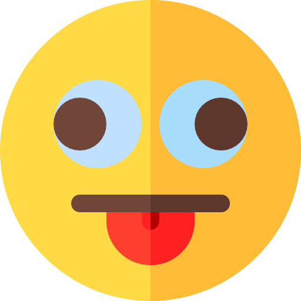
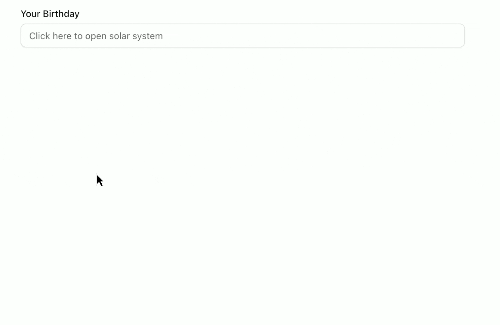
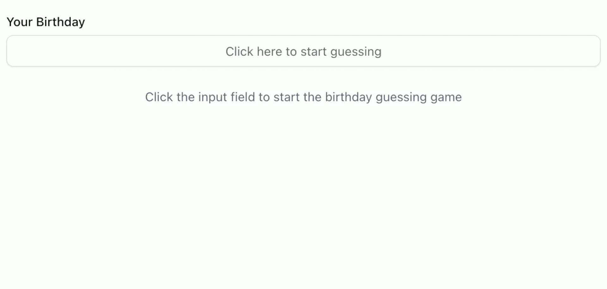
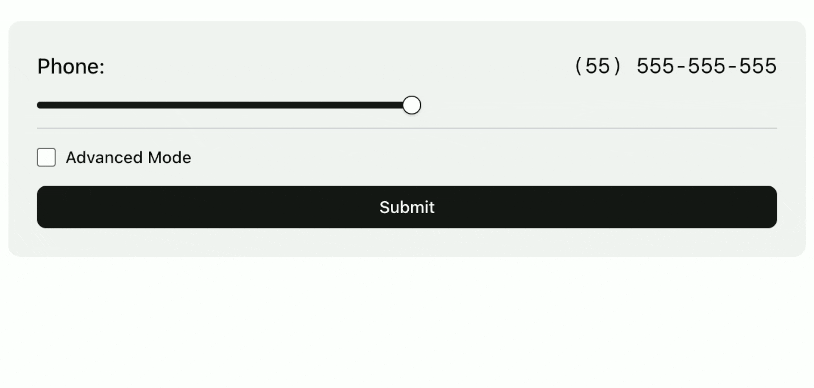

#  GoofyUI


[](https://github.com/abderrahimghazali/goofyui/stargazers)

## A collection of the most wonderfully terrible UI designs. Frustrating? Yes. Hilarious? Absolutely! 🎨🤪

This repository showcases intentionally bad UI/UX patterns that are both amusing and educational. Perfect for demonstrating what NOT to do in interface design!

## 🎭 Live Demo

Visit [GoofyUI](https://goofyui.vercel.app) to experience the chaos yourself!

## 🎪 Featured Components

### 🌍 Solar System Birthday Picker
Forget dropdown calendars! Rotate Earth around the sun to select your birthdate. One full orbit = one year!



### 🎯 Birthday Guesser
Why type your birthday when the computer can guess it? Uses binary search with "Earlier" and "Later" buttons. Only takes ~20 clicks!



### 📱 Phone Number Slider
Enter your phone number by sliding a single slider that controls all 10 digits. Features an "advanced mode" with physics simulation!



## 🚀 Getting Started

```bash
# Clone the repository
git clone https://github.com/abderrahimghazali/goofyui.git

# Navigate to project directory
cd goofyui

# Install dependencies
npm install

# Run development server
npm run dev
```

Open [http://localhost:3000](http://localhost:3000) to see the result.

## 🛠️ Built With

- **Next.js 15.5** - React framework with App Router
- **React 19.1** - UI library
- **TypeScript** - Type safety
- **Tailwind CSS 4.0** - Styling
- **shadcn/ui** - Component library
- **Radix UI** - Headless UI components

## 🤝 Contributing

Got a terrible UI idea? We want it!

1. Fork the repository
2. Create your feature branch (`git checkout -b feature/terrible-ui-idea`)
3. Commit your changes (`git commit -m 'Add hilariously bad component'`)
4. Push to the branch (`git push origin feature/terrible-ui-idea`)
5. Open a Pull Request

## 📝 Guidelines for Bad UI

- Must be functional (actually work, even if poorly)
- Should be frustrating but not impossible
- Bonus points for making users laugh
- Extra bonus points for educational value

## 🎉 Inspiration

Inspired by the wonderful world of bad UI/UX design and the [BadUI](https://github.com/GoulartNogueira/BadUI) community.

## 📄 License

This project is licensed under the MIT License - see the [LICENSE](LICENSE) file for details.

## ⭐ Support

If this made you laugh (or cry), give it a star!

---

<div align="center">
  <p>Made with 😈 and a questionable sense of UX design</p>
  <a href="https://github.com/abderrahimghazali/goofyui">
    
  </a>
</div>